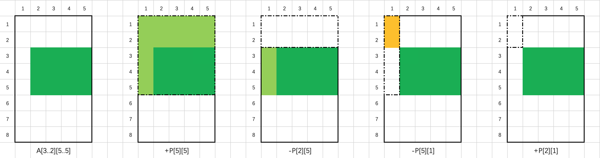

### 二维前缀和问题

设二维数组 A 的大小为 m * n，行下标的范围为 [1, m]，列下标的范围为 [1, n]。

数组 P 是 A 的前缀和数组，等价于 P 中的每个元素 P[i][j]：

如果 i 和 j 均大于 0，那么 P[i][j] 表示 A 中以 (1, 1) 为左上角，(i, j) 为右下角的矩形区域的元素之和；

如果 i 和 j 中至少有一个等于 0，那么 P[i][j] 也等于 0。

数组 P 可以帮助我们在 O(1)O(1) 的时间内求出任意一个矩形区域的元素之和。具体地，设我们需要求和的矩形区域的左上角为 (x1, y1)，右下角为 (x2, y2)，则该矩形区域的元素之和可以表示为：

sum = A[x1..x2][y1..y2]
    = P[x2][y2] - P[x1 - 1][y2] - P[x2][y1 - 1] + P[x1 - 1][y1 - 1]
其正确性可以通过容斥原理得出。以下图为例，当 A 的大小为 8 * 5，需要求和的矩形区域（深绿色部分）的左上角为 (3, 2)，右下角为 (5, 5) 时，该矩形区域的元素之和为 P[5][5] - P[2][5] - P[5][1] + P[2][1]。




### lc-1314

给你一个 m x n 的矩阵 mat 和一个整数 k ，请你返回一个矩阵 answer ，其中每个 answer[i] [j] 是所有满足下述条件的元素 mat[r] [c] 的和： 

i - k <= r <= i + k,
j - k <= c <= j + k 且
(r, c) 在矩阵内。


示例 1：

输入：mat = [[1,2,3],[4,5,6],[7,8,9]], k = 1
输出：[[12,21,16],[27,45,33],[24,39,28]]


#### 二维前缀和+枚举

```c++
class Solution {
public:
    int get(const vector<vector<int>>& pre, int m, int n, int x, int y) {
        x = max(min(x, m), 0);
        y = max(min(y, n), 0);
        return pre[x][y];
    }
    
    vector<vector<int>> matrixBlockSum(vector<vector<int>>& mat, int K) {
        int m = mat.size(), n = mat[0].size();
        vector<vector<int>> P(m + 1, vector<int>(n + 1));
        for (int i = 1; i <= m; ++i) {
            for (int j = 1; j <= n; ++j) {
                P[i][j] = P[i - 1][j] + P[i][j - 1] - P[i - 1][j - 1] + mat[i - 1][j - 1];
            }
        }
        
        vector<vector<int>> ans(m, vector<int>(n));
        for (int i = 0; i < m; ++i) {
            for (int j = 0; j < n; ++j) {
                ans[i][j] = get(P, m, n, i + K + 1, j + K + 1) - get(P, m, n, i - K, j + K + 1) - get(P, m, n, i + K + 1, j - K) + get(P, m, n, i - K, j - K);
            }
        }
        return ans;
    }
};

```

