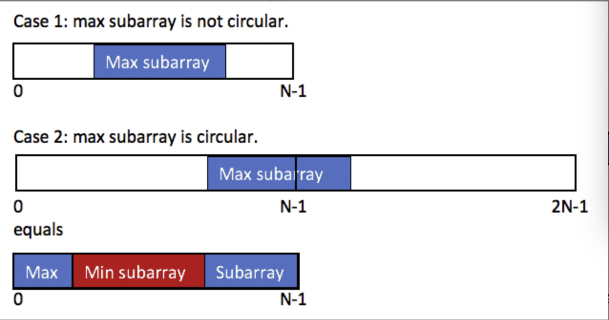

最大子数组类型，有通用状态转移方程：
$$
f(n)=max(f(n-1)+nums[i],nums[i])
$$
同理也能用滚动数组优化空间。

延伸---环形子数组的最大和

### lc-918

给定一个长度为 n 的环形整数数组 nums ，返回 nums 的非空 子数组 的最大可能和 。

环形数组 意味着数组的末端将会与开头相连呈环状。形式上， nums[i] 的下一个元素是 nums[(i + 1) % n] ， nums[i] 的前一个元素是 nums[(i - 1 + n) % n] 。

子数组 最多只能包含固定缓冲区 nums 中的每个元素一次。形式上，对于子数组 nums[i], nums[i + 1], ..., nums[j] ，不存在 i <= k1, k2 <= j 其中 k1 % n == k2 % n 。

 

示例 1：

输入：nums = [1,-2,3,-2]
输出：3
解释：从子数组 [3] 得到最大和 3


若使用动态规划，很难对环形数组中的元素是否遍历过进行判断，导致子数组中出现重复使用的元素。

分析
这题一共有两种情况（也就是相当于比53题多了一种最大子数组和是首尾连接的情况）
下面的这个子数组指最大和的子数组

第一种情况：这个子数组不是环状的，就是说首尾不相连。
第二种情况：这个子数组一部分在首部，一部分在尾部，我们可以将这第二种情况转换成第一种情况
如下图：


所以这最大的环形子数组和 = max(最大子数组和，数组总和-最小子数组和)



证明
证明一下第二种情况（最大子数组是环形的）
max(前缀数组+后缀数组)
= max(数组总和 - subarray) subarray指的是前缀数组和后缀数组中间的数组
= 数组总和 + max(-subarray) 数组总和是不变的，直接提出来
= 数组总和 - min(subarry) 。。。这个都懂吧，把负号提出来，max变成min

极端情况：如果说这数组的所有数都是负数，那么上面的公式还需要变一下，因为这种情况，对于上面的第一种情况sum会等于数组中的最大值，而对二种情况sum=0（最小的子数组就是本数组，total-total=0）。所以多加一个case，判断最大子数组和是否小于0，小于0，直接返回该maxSubArray

```c++
    int maxSubarraySumCircular(vector<int>& A) {
        int total = 0, maxSum = A[0], curMax = 0, minSum = A[0], curMin = 0;
        for (int& a : A) {
            curMax = max(curMax + a, a);
            maxSum = max(maxSum, curMax);
            curMin = min(curMin + a, a);
            minSum = min(minSum, curMin);
            total += a;
        }
        return maxSum > 0 ? max(maxSum, total - minSum) : maxSum;
    }

```

