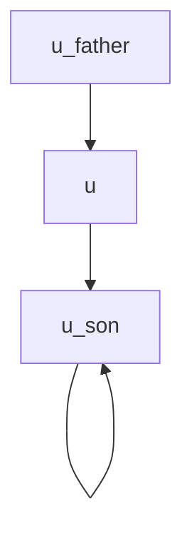
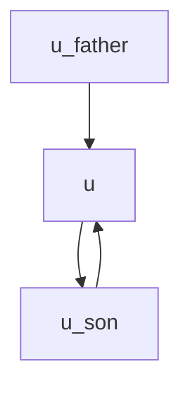
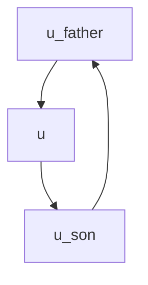

### lc-1460

给你两个长度相同的整数数组 target 和 arr 。每一步中，你可以选择 arr 的任意 非空子数组 并将它翻转。你可以执行此过程任意次。

如果你能让 arr 变得与 target 相同，返回 True；否则，返回 False 。

 

根据冒泡排序的启示，同一数组中可以通过一定的变换得到特殊的序列，即只要arr拥有与target中相同的元素，即可通过「翻转」子数组得到与target相同的整数数组；故题目演变为检查target和arr中的元素是否完全相同，可以使用哈希表来记录target中的元素及其出现次数，并与arr对比即可。

```c++
bool canbeEqual(vector<int>& target,vector<int>& arr){
  int n=target.size();
  unordered_map<int,int> docs;
  for(int i=0;i<n;i++){
    docs[target[i]]++;
  }
  for(int i=0;i<n;i++){
    docs[arr[i]]--;
    if(docs[arr[i]]==0)
      docs.erase(arr[i]);
  }
  return docs.size()==0;
}
```


### lc-1192

力扣数据中心有 n 台服务器，分别按从 0 到 n-1 的方式进行了编号。它们之间以「服务器到服务器」点对点的形式相互连接组成了一个内部集群，其中连接 connections 是无向的。从形式上讲，connections[i] = [a, b] 表示服务器 a 和 b 之间形成连接。任何服务器都可以直接或者间接地通过网络到达任何其他服务器。

「关键连接」 是在该集群中的重要连接，也就是说，假如我们将它移除，便会导致某些服务器无法访问其他服务器。

请你以任意顺序返回该集群内的所有 「关键连接」。


此题中的「关键连接」即为「桥」。

「桥」：在一连通的无向图中，若去除某一边后会使得图不再连通，则这条边可以视作「桥」。

与之相应的概念还有「割点」。

「割点」：在一连通的无向图中，若去除某一点及所有与其相连的边后会使得图不再连通，则这个点可以视作「割点」。


用于求图中的「桥」与「割点」有一算法：tarjan算法，这个算法使用先递归的访问相邻节点后访问节点自身的dfs方法，通过记录「访问的顺序：DFN」以及在递归结束后访问节点自身时探索其可以回溯到的最早被访问的节点来更新「最早可回溯的节点：low」，可以实现在O(n)时间内找到图的「桥」与「割点」。同时，此种算法可以用于查找有向图中的强连通分量。


tarjan算法更新DFN与low的规则：

tarjan(int u,int fa);

1.每次调用tarjan时，将DFN[u]与low[u]置为++count；

2.遍历u的相邻节点v，若v是u的父亲节点fa，则跳过这个v；若v未被访问过，则递归调用tarjan(v,u)；若v已被访问过，说明出现了「环」，可以回溯u的low值，将u的low值更新为min(DFN[v],low[u]);

3.遍历完u的所有相邻节点后，将low[u]更新为min(low[u],low[v]),意义在于将同一连通分量内可以回溯到的最早节点统；并对比DFN[u]与low[v]的大小，得到「桥」。


tarjan算法求桥的核心思想：

DFN[u]<low[v],

解释：

当DFN[u]<low[v]时，说明u的子节点无论如何也无法到达比u更早的节点，即




在子节点中，不存在指向比u和u更早节点的边，故{u,v}这条边必然是桥。

当DFN[u]==low[v]时：




说明子节点中有一条指向u的边，则去除{u,v}后仍然不影响图的连通性，故{u,v}不是桥。

当DFN[u]>low[v]时：



则说明u的子节点中存在指向比u更早出现的点的边，则去除{u,v}仍然不影响图的连通性，故{u,v}不是桥。

以示例1中的图为例：

```
connections = [[0,1],[1,2],[2,0],[1,3]]
```

从root节点0出发，DFN[0]=1,low[0]=1，节点0有相邻节点1、2且都未访问，访问节点1;

进入节点1，DFN[1]=2,low[1]=2，节点1有相邻节点0、2、3，其中0是1的父亲节点，不予处理，访问节点2;

进入节点2，DFN[2]=3,low[2]=3，节点2的相邻节点有1、0，都已访问过，且节点1是节点2的父亲节点，则可以将low[2]更新为1，DFN[2]=3,low[2]=1,并且递归回到节点1的循环中，将low[1]也更新为1。节点1还有一个相邻节点3未被访问，访问节点3;

进入节点3，DFN[3]=4,low[3]=4，节点3只有一个相邻节点1且是其父亲节点，直接递归回到节点1的循环中，比较DFN[1]与low[3]发现，DFN[1]=2,low[3]=4,DFN[1]<low[3],故{1,3}是桥，将其加入res中，最后递归回到0的循环中，结束tarjan算法。

DFS(0)

   |----->DFS(1)

   |			|----->DFS(2)

   |			|			|----->2

   |			|			

   |			DFS(3)

   |             |------>3

   |			 |      

   | 			 1

   0

代码实现：

```c++
class Solution{
public;
  int count=0;
  vector<int> dfn,low;
  vector<vector<int>> graph;
  vector<vector<int>> res;
  int tarjan(int u,int fa){
    dfn[u]=low[u]=++count;
    for(auto& v:graph[u]){
      if(v==fa)
        continue;
      if(!dfn[v]){
        tarjan(v,u);
        low[u]=min(low[u],low[v]);
        if(dfn[u]<low[v])
          res.push_back({u,v});
      }
      else{
        low[u]=min(dfn[v],low[u]);
      }
    }
  }
  
  vector<vector<int>> criticalConnections(int n,vector<vector<int>& connections){
    dfn.resize(n);
    low.resize(n);
    graph.resize(n);
    for(auto& edge:connections){
      graph[edge[0]].push_back(edge[1]);
      graph[edge[1]].push_back(edge[0]);
    }
    for(int i=0;i<n;i++){
      if(!dfn[i])
        tarjan(i,-1);
    }
    return res;
  }
};
```


### lc-994

在给定的 m x n 网格 grid 中，每个单元格可以有以下三个值之一：

值 0 代表空单元格；
值 1 代表新鲜橘子；
值 2 代表腐烂的橘子。
每分钟，腐烂的橘子 周围 4 个方向上相邻 的新鲜橘子都会腐烂。

返回 直到单元格中没有新鲜橘子为止所必须经过的最小分钟数。如果不可能，返回 -1 。

 

本题考查BFS的运用，经过的分钟数即层次遍历的层数，每层将当前腐烂的橘子的周围4个方向的新鲜橘子（若存在）放入队列，并将新鲜橘子标记为腐烂，最后队列为空后检查是否还有新鲜橘子即可。

首先还需要遍历矩阵统计新鲜橘子数量和腐烂橘子数量用于剔除一些特殊情况，同时将遍历到的腐烂橘子放入队列中。


```c++
int orangeRotting(vector<vector<int>>& grid){
  int m=grid.size(),n=grid[0].size();
  int res=-1;//将最初的腐烂橘子剔除
  int freshorange=0,rotorange=0;
  vector<pair<int,int>> dir={{0,1},{0,-1},{1,0},{-1,0}};
  for(int i=0;i<m;i++){
    for(int j=0;j<n;j++){
      if(grid[i][j]==1)
        freshorange++;
      else if(grid[i][j]==2){
        q.push({i,j});
        rotorange++;
      }
    }
  }
  if(freshorange==0)
    return 0;
  if(freshorange!=0&&rotorange==0)
    return -1;
 	while(!q.empty()){
    int sz=q.size();
    res++;
    for(int i=0;i<sz;i++){
      pair<int,int> cur=q.front();
      q.pop();
      for(int j=0;j<4;j++){
        int newx=cur.first+dir[j].first;
        int newy=cur.second+dir[j].second;
        if(newx<m&&newx>=0&&newy<n&&newy>=0&&grid[newx][newy]==1){
          q.push({newx,newy});
          grid[newx][newy]=2;
          freshorange--;
        }
        if(freshorange==0)
          break;
      }
    }
  }
  return freshorange==0?res:-1;
}
```


### lc-763

字符串 S 由小写字母组成。我们要把这个字符串划分为尽可能多的片段，同一字母最多出现在一个片段中。返回一个表示每个字符串片段的长度的列表。

 

示例：

输入：S = "ababcbacadefegdehijhklij"
输出：[9,7,8]
解释：
划分结果为 "ababcbaca", "defegde", "hijhklij"。
每个字母最多出现在一个片段中。
像 "ababcbacadefegde", "hijhklij" 的划分是错误的，因为划分的片段数较少。


使用一个数组signal记录每个字母最晚出现的下标，在遍历字符串时，维护一个end变量，指示当前子字符串是否可以划分为一个片段，end=max(signal[i],end),若可以划分则将i-lasti+1置入res，并将lasti更新为i+1。

```c++
vector<int> partitionLabels(string s){
  vector<int> res;
  int n=s.size();
  int end=0,lasti=0;
  vector<int> signal(26);
  for(int i=0;i<n;i++){
    signal[s[i]-'a']=i;
  }
  for(int i=0;i<n;i++){
    end=max(end,signal[s[i]-'a']);
    if(end==i){
      res.push_back(i-lasti+1);
      lasti=i+1;
    }
  }
  return res;
}
```

